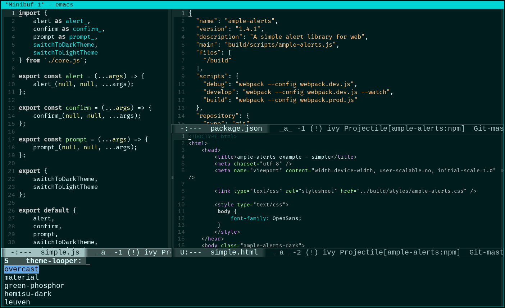

# theme-looper

  

A convenience package to switch themes in Emacs.

> Note: Breaking changes in version 2

## Background

### (You may directly skip to Usage)

Emacs 24 and later comes with a set of pre-installed color-themes that can be enabled by a simple command like:

    M-x load-theme RET wombat
    
The above command enables (rather activates) 'wombat' theme. However, when you get lazy as I did, you need something like theme-looper.el. So, if you have a list of your favorite color-themes and you want to cycle thru them with simple keystrokes, you've come to the right place.

## Installation

### Manual

Save the file 'theme-looper.el' to disk and add the directory containing it to 'load-path' using a command in your '.emacs' file like:

    (add-to-list 'load-path "~/.emacs.d/")
    
The above line assumes that you've placed the file into the Emacs directory '.emacs.d'.

Start the package with:

    (require 'theme-looper)

### MELPA-Stable / MELPA / Marmalade

If you have MELPA-Stable, MELPA or Marmalade added as a repository to your Emacs, you can just install *theme-looper* with

    M-x package-install theme-looper RET

## Usage

### Set key-bindings to switch themes like a breeze

    (global-set-key (kbd "C-}") 'theme-looper-enable-next-theme)
    (global-set-key (kbd "C-{") 'theme-looper-enable-previous-theme)
    (global-set-key (kbd "C-\") 'theme-looper-enable-random-theme)

### *Optional:* Set a list of your favorite color themes:

By specifying a particular set of themes

    (theme-looper-set-favorite-themes '(wombat tango-dark wheatgrass))

or using a regular expression

    (theme-looper-set-favorite-themes-regexp "dark")

### *Optional:* Set a list of ignored themes:

By specifying a particular set of themes

    (theme-looper-set-ignored-themes '(cobalt))

or using a regular expression

    (theme-looper-set-ignored-themes-regexp "green")

### *Optional:* Set both

In this case, only the favorite themes that are not within the ones to be ignored are used.

### More

If you want to reset your color-theme preferences, simply use

    (theme-looper-reset-themes-selection)

You can set some script to be run after every theme switch

    (theme-looper-set-post-switch-script 'my-func)

## Acknowledgments

Thanks to [protonpopsicle](https://github.com/protonpopsicle), [zombiefungus](https://github.com/zombiefungus), [romildo](https://github.com/romildo) and [4goodapp](https://github.com/4goodapp) for their valuable inputs to suggest changes and enhancements.
